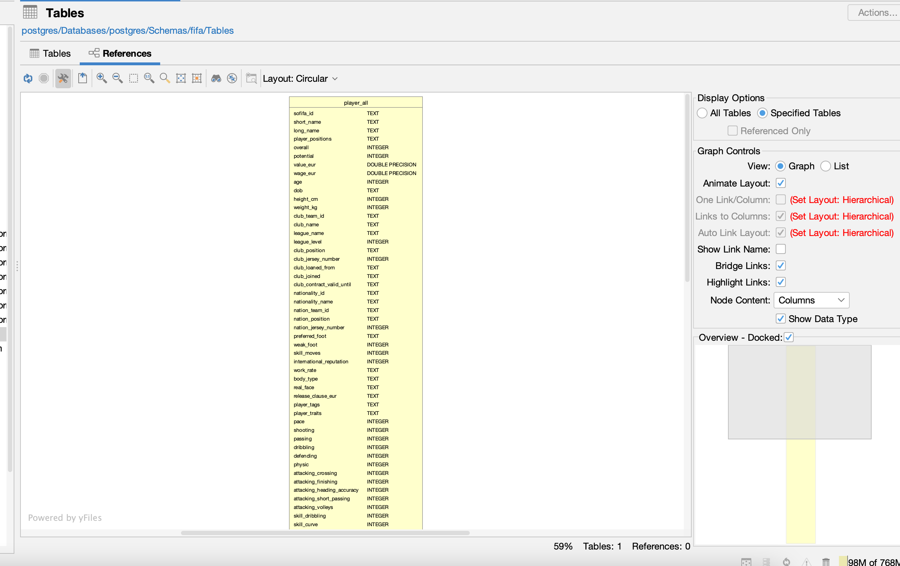
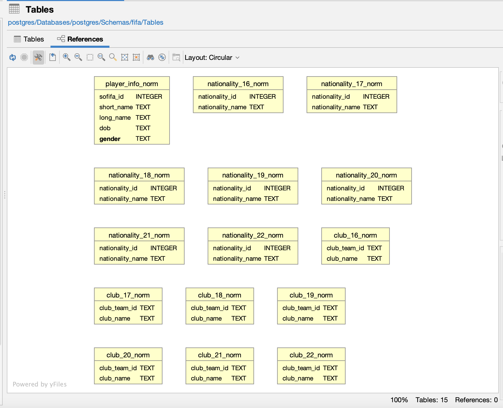

# 14-810 Course Project
#### Author: Jingde Chen, Xintong Wu

### Task I
Data set constrains:
1. Some attributes need to be hardcoded in the script for preprocessing. e.g. Year, Skills.
2. Part of the skillsets were represented as a mathmatical formula such as "90+4". We need to evaluate these entries as part of the preprocessing.
3. Attribute types casting is required for data analysis. For example, club_team_id was represented in double but we want them to be in String type and no decimal part.

Database format:
All tables are stored in the Postgresql under fifa schema.

__Main table: player_all__

Extra tables from normalization: 
- club_16_norm - club_22_norm
- nationality_16_norm - nationality_22_norm
- player_info_norm

